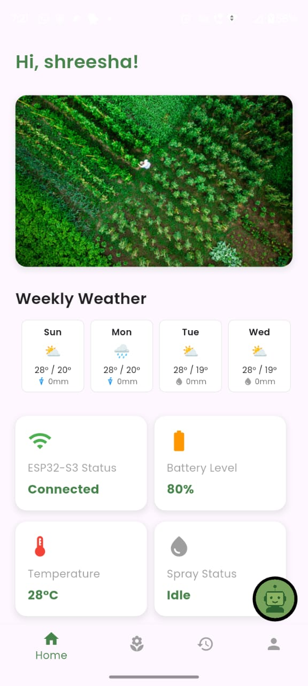
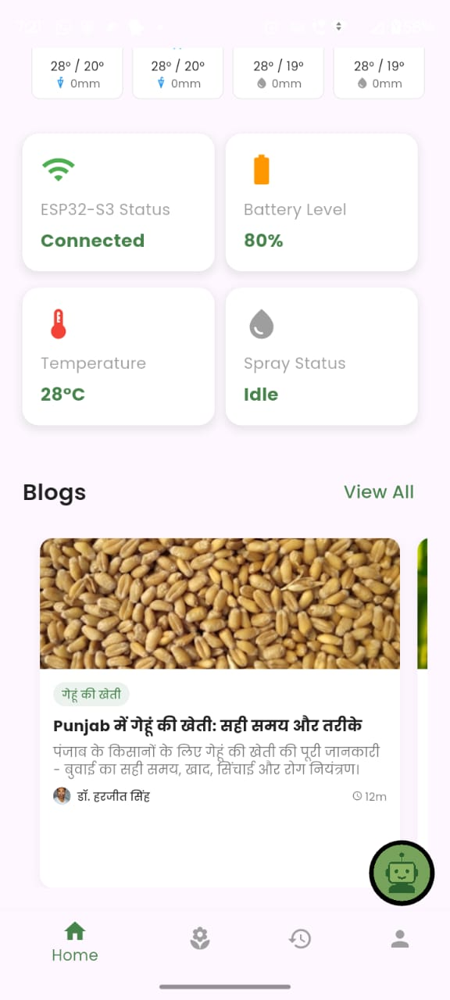
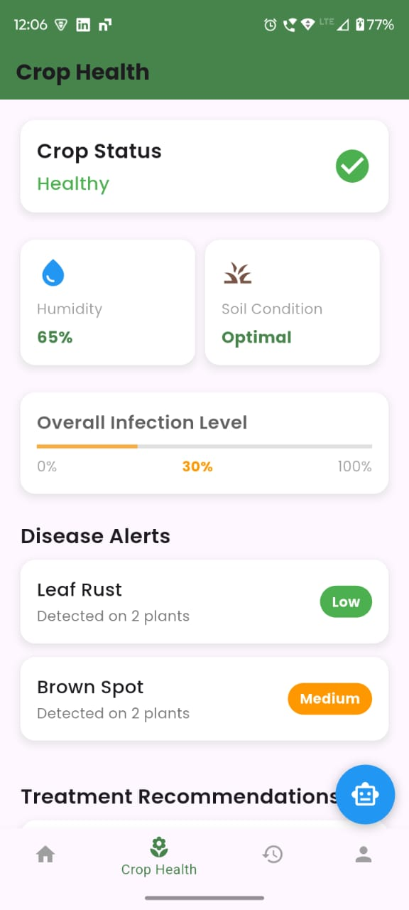
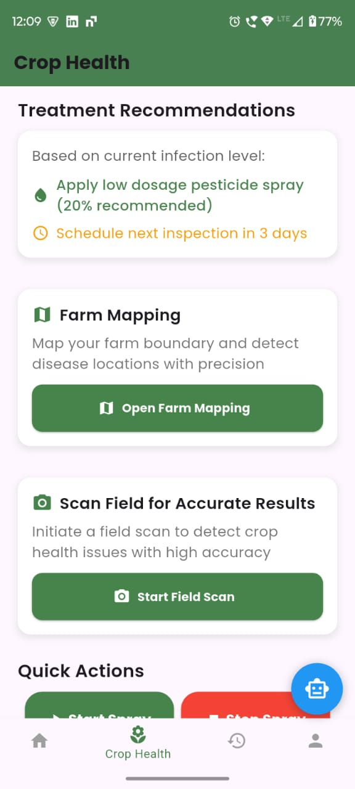
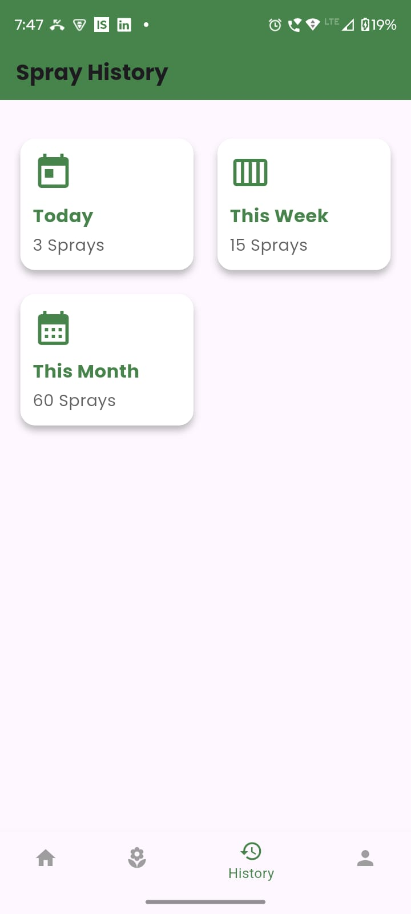
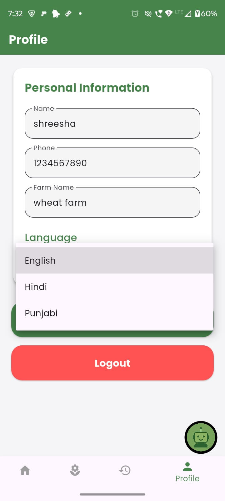
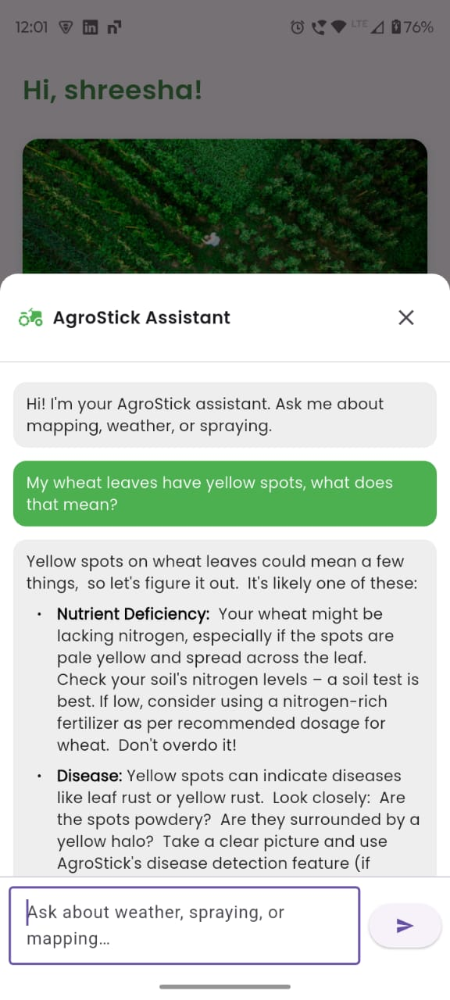

# AgroStick – Smart Farming Assistant

AgroStick is an AI-powered smart farming application integrated with affordable hardware (ESP32, sensors, and camera) to help farmers optimize pesticide spraying, monitor crop health, and improve yields.  

The system is designed with rural usability in mind:  
- Multi-language support (English, Hindi, Punjabi)  
- Offline-first approach (data syncs when internet is available)  
- Simple farmer-friendly interface  

---

## Features

### Home Screen

  

    <ul>
      <li>Weekly weather forecast to help farmers plan around rainfall and temperature conditions.</li>
      <li>Hardware integration for real-time ESP32 data including battery level, field temperature, and spray status.</li>
      <li>Blogs section for agricultural knowledge and updates.</li>
    </ul>
  

  

    
    
    <!--  -->
  

---

### Crop Health Screen

  

    <ul>
      <li>Farm selection and field scanning using AI for disease detection.</li>
      <li>Quick actions: start spraying, stop spraying, and schedule spray.</li>
      <li>View environmental conditions such as temperature and humidity.</li>
      <li>Treatment recommendations generated based on scan results.</li>
    </ul>
  

  

    
    
  

---

### History Screen

  

    <ul>
      <li>Detailed spray history for better farm planning.</li>
      <li>Records past treatments and spray schedules.</li>
    </ul>
  

  

    
  

---

### Multi-Language Support

  

    <ul>
      <li>Supports English, Hindi, and Punjabi.</li>
      <li>Farmer-friendly design with simple navigation and localized interface.</li>
    </ul>
  

  

    
  

---

### Chatbot

  

    <ul>
      <li>Farmers can ask agriculture-related questions directly within the app.</li>
      <li>Provides instant responses and guidance for farm-related queries.</li>
    </ul>
  

  

    
  

---

## Technical Stack

- **Frontend**: Flutter (cross-platform mobile development)  
- **Backend**: Firebase (authentication, data sync, history storage)  
- **Hardware**:  
- **ML Model**: 
- **Deployment**: Android App Bundle (AAB) for optimized delivery  

---

## Impact

- Reduce pesticide use by up to 40%  
- Save farmers up to 30% in costs  
- Increase crop yield by 15–20%  
- Environmentally sustainable by reducing chemical overuse  

---

<!-- 
## Links

- Documentation: See `docs/SIH2025015_SynergySix-1.pdf`   -->